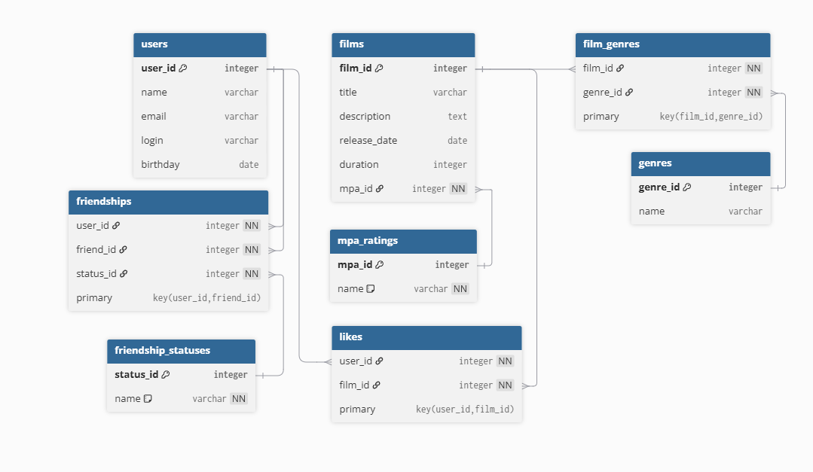

# Схема базы данных и примеры запросов

## Пояснение к схеме

- **users** - таблица пользователей приложения.
- **films** - таблица фильмов.
- **mpa_ratings** - справочник MPA-рейтингов (G, PG, PG-13, R, NC-17).
- **genres** - справочник жанров.
- **film_genres** - связка фильмов и жанров (многие-ко-многим).
- **likes** - лайки фильмов пользователями (для рейтингов и топа).
- **friendship_statuses** - справочник статусов дружбы (UNCONFIRMED, CONFIRMED).
- **friendships** - таблица дружбы пользователей со статусом.

---

## Примеры SQL-запросов

### 1. Получить все фильмы
```sql
SELECT * FROM films;
```

### 2. Получить все жанры фильма с id = 10
```sql
SELECT g.name
FROM genres g
JOIN film_genres fg ON g.genre_id = fg.genre_id
WHERE fg.film_id = 10;
```

### 3. Получить топ-5 популярных фильмов
```sql
SELECT f.film_id, f.title, COUNT(l.user_id) AS likes_count
FROM films f
LEFT JOIN likes l ON f.film_id = l.film_id
GROUP BY f.film_id, f.title
ORDER BY likes_count DESC
LIMIT 5;
```

### 4. Подтвердить дружбу
```sql
UPDATE friendships
SET status_id = (SELECT status_id FROM friendship_statuses WHERE name = 'CONFIRMED')
WHERE user_id = 2 AND friend_id = 1;
```